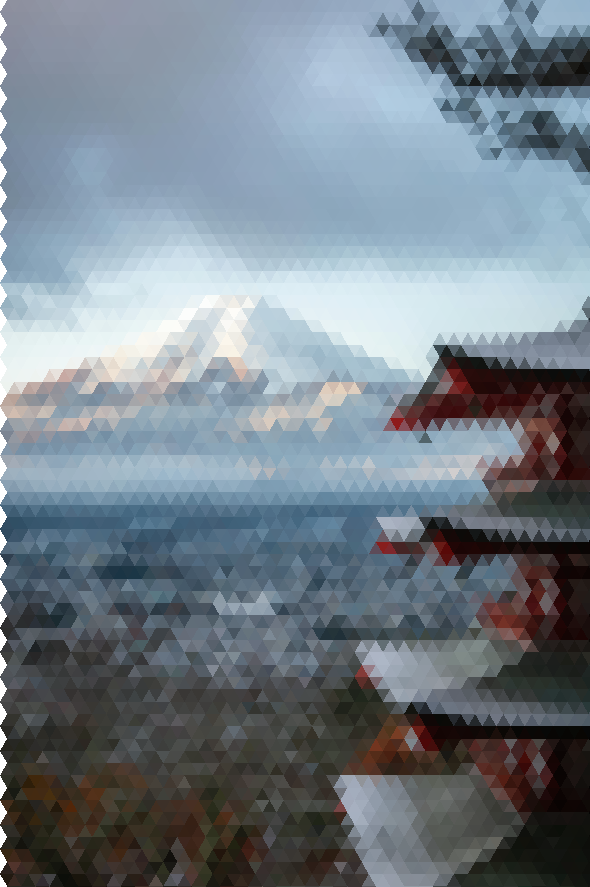

# Triangle Pixelate

This Python tool transforms any image into a mosaic of equilateral triangles, creating a unique geometric effect. Each triangle is colored either by the average color or by the most frequent color in its area.

## Features
- Converts images into a tessellation of equilateral triangles (hexagonal grid)
- Adjustable triangle size
- Option to use the dominant color (most frequent) or the average color for each triangle

## Example
Below is an example using the file `japan.jpg` with a triangle size of 100:

**Original image:**


**Transformed image:**



## Usage

Install dependencies:

```bash
pip install numpy pillow
```

Run the script:

```bash
python triangle_pixelate.py input_image output_image [triangle_size] [--dominant]
```

- `input_image`: Path to the input image
- `output_image`: Path to the output image
- `triangle_size`: Size of the triangles (default: 20)
- `--dominant`: Use the most frequent color instead of the mean

Example:

```bash
python triangle_pixelate.py japan.jpg japan-transformated.png 100 --dominant
```

## License
MIT
